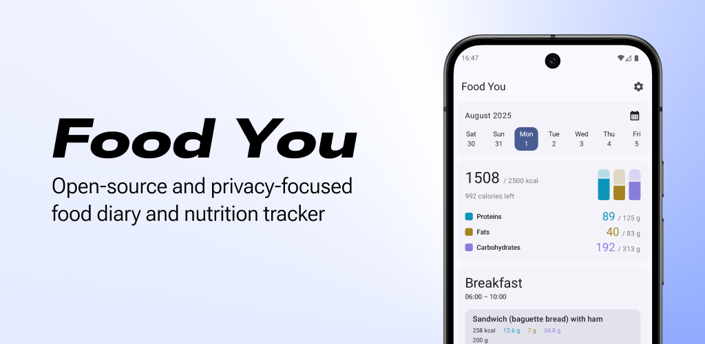

# Food You

A free, open-source, and privacy-focused food diary and nutrition tracker built using Material
Design principles.

## Get Started

1. Download Food You from [F-Droid](https://f-droid.org/en/packages/com.maksimowiczm.foodyou/)
   or [GitHub](https://github.com/maksimowiczm/FoodYou/releases/)
2. Open the app, no sign-up required
3. Start logging meals and tracking nutrition

## Why Food You?

Food You is designed for people who want full control over their nutrition data without sacrificing
usability or design.

- **Privacy first**  
  No accounts, no analytics, no tracking. All data is stored locally on your device.

- **Modern Material You design**  
  Clean UI following [Material Design](https://m3.material.io/) principles.

- **Offline-friendly**  
  Works without an internet connection once food data is available.

- **Open source & transparent**  
  Fully open-source and developed in the open. Anyone can inspect the code
  and contribute ideas to improve the app.

## Features

- **Modular home screen**  
  Customize your dashboard with cards that match your habits.

- **Comprehensive food databases**  
  Integrated access to Open Food Facts and USDA FoodData Central

- **Full nutrition tracking**  
  Set and track personalized nutrition targets, monitoring not only calories and macros but also
  vitamins, minerals, and other essential nutrients

- **Recipe creation**  
  Build custom recipes from individual foods and get instant nutrition values.

!!! tip "Spread the Word"
    If you enjoy using Food You, consider starring the project on 
    [GitHub](https://github.com/maksimowiczm/FoodYou) or sharing it with others. Your support helps 
    the project grow and reach more users.